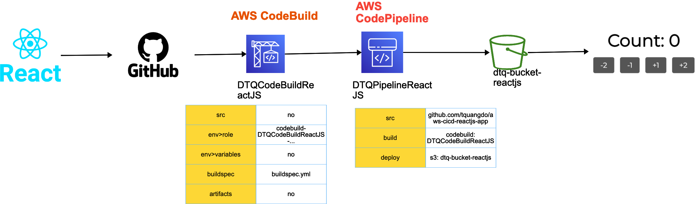
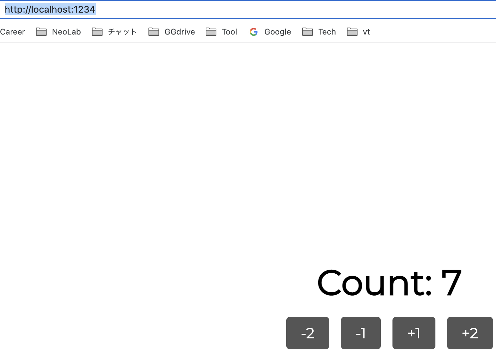
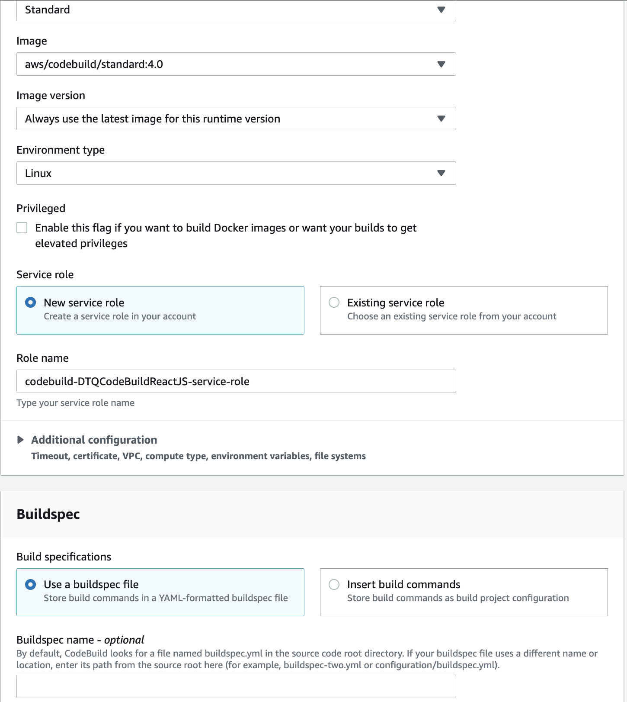
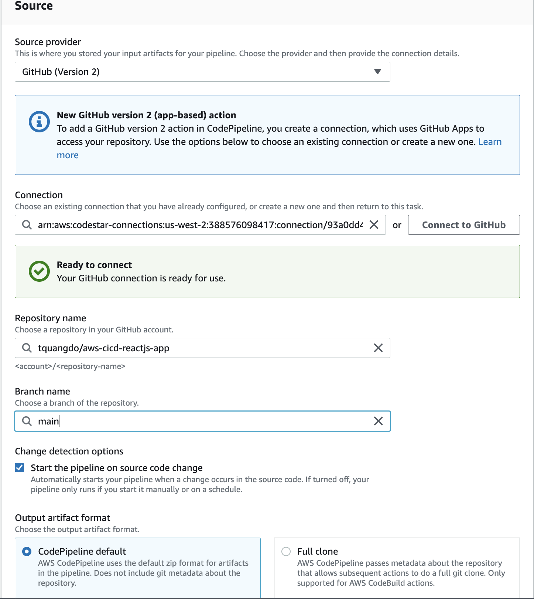
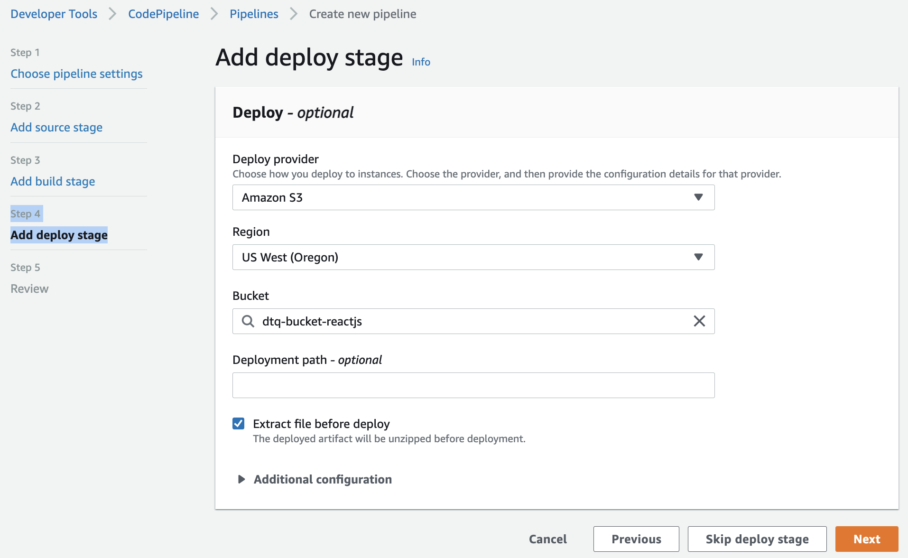
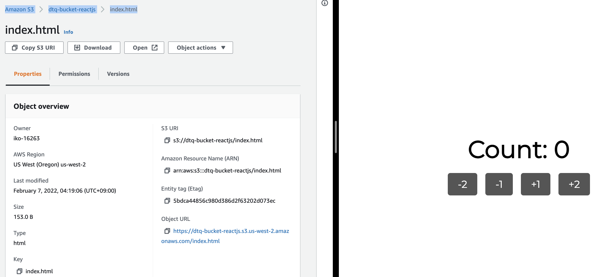

# aws-cicd-reactjs-count 🐳


[](https://github.com/tquangdo/aws-cicd-reactjs-count/issues/new)



## reference
[youtube](https://www.youtube.com/watch?v=zkNdHv1iMgY)

## local
### A) test
```shell
yarn test
=>
Test Suites: 2 passed, 2 total
Tests:       2 passed, 2 total
Snapshots:   0 total
Time:        2.932s
```
- edit `src/components/Root/Counter/Counter.js`
```js
dispatch(-200) // OK: dispatch(-2)
```
- test again
```shell
yarn test
=>
Test Suites: 1 failed, 1 passed, 2 total
Tests:       1 failed, 1 passed, 2 total
Snapshots:   0 total
Time:        2.796s
```
### B) run
```shell
yarn install && yarn watch
```
- access `http://localhost:1234/` on browser


## AWS
### 1) S3
- create name=`dtq-bucket-reactjs`
- block=`OFF`
- bucket policy:
```json
{
	"Version": "2012-10-17",
	"Statement": [
		{
			"Sid": "Statement1",
			"Principal": "*",
			"Effect": "Allow",
			"Action": "s3:GetObject",
			"Resource": "arn:aws:s3:::dtq-bucket-reactjs/*"
		}
	]
}
```
### 2) CodeBuild
- create name=`DTQCodeBuildReactJS`

### 3) CodePipeline
[cicd](https://docs.google.com/spreadsheets/d/1m8LuBQUzqIQ0bJYb3NJZOT4iSb78xUEG/edit#gid=1878281573&range=B5)
- create name=`DTQPipelineReactJS`
- src stage:

- build stage: create `DTQCodeBuildReactJS`
- deploy stage:

### 4) result
- `dtq-bucket-reactjs` > `index.html` > click `Object URL`

### 5) delete AWS resources
`./del_aws_resource.sh`
